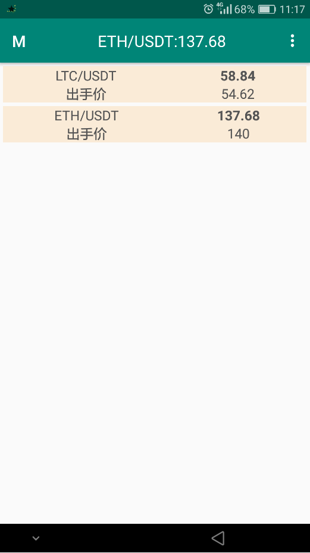

### 目的
平时观察中发现，币价在一定时间内增长达到一定幅度后还会继续增长，或者达到某个值后还会增长，于是写该软件用来监控这两种情况的的发生，闹铃或者震动通知，及时买入。

### apk
下载[价格监视器](https://github.com/JokerZhouHao/price_monitor/raw/master/app/release/app-release.apk)

### 截图
 
